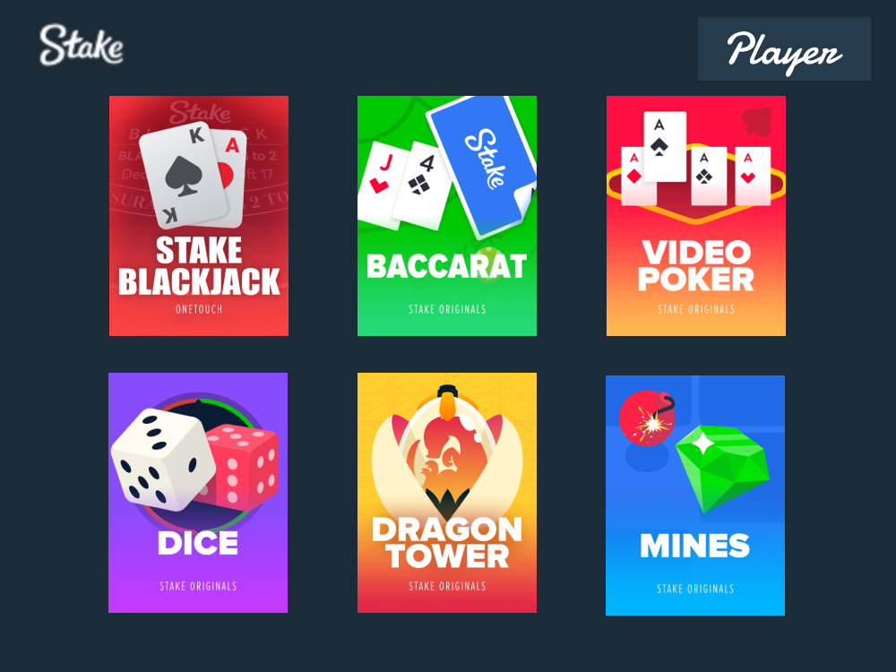
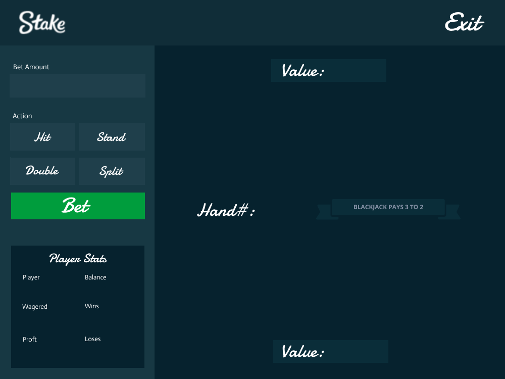
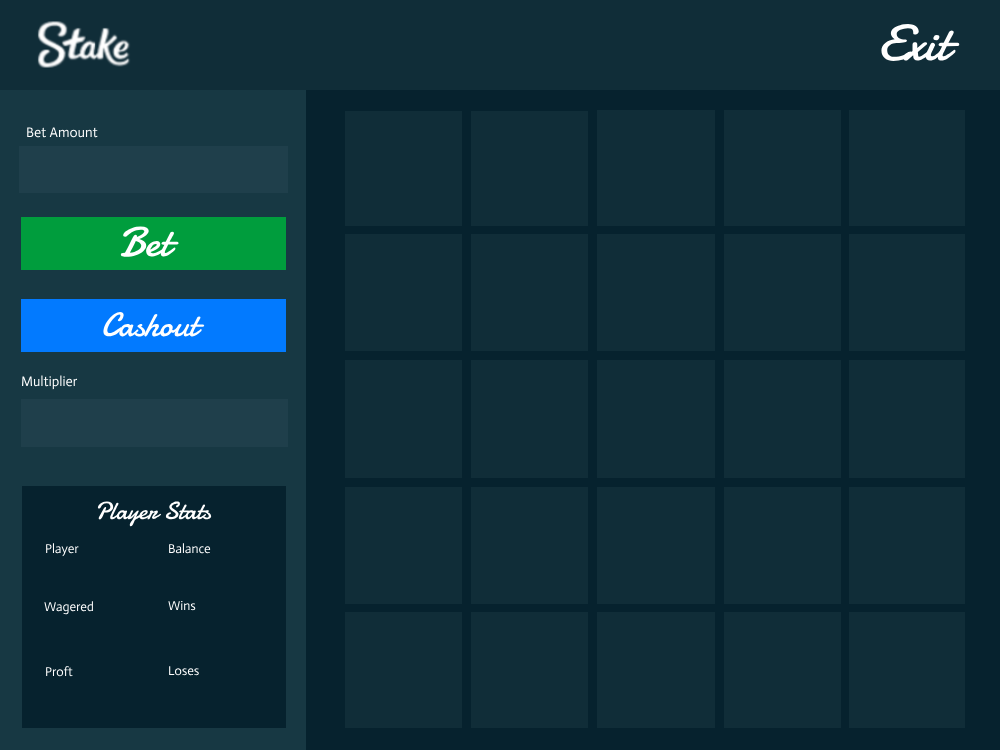

# Stake

A desktop casino built in Java Swing, modelled on the mini games from the gambling site Stake. Pick a player, pick a game, and bet a virtual balance across six games: Blackjack, Baccarat, Video Poker, Dice, Dragon Tower and Mines. Balances persist between sessions.




## Games

| Game | How it plays | Payout model |
| --- | --- | --- |
| **Blackjack** | Hit, stand or double down against a dealer that stands on 17. Six-deck shoe. | Wins pay 1:1, a natural blackjack pays 3:2, dealer natural loses, both is a push. |
| **Baccarat** | Bet on Player, Banker or Tie. Third-card draws follow the standard banker table. | Player 1:1, Banker 19:20, Tie 8:1. Player and Banker bets push on a tie. |
| **Video Poker** | Bet on which five-card hand you will be dealt, from a pair of Jacks up to a Royal Flush. | Each hand pays its true odds, e.g. Royal Flush at 649,740:1. |
| **Dice** | Roll six dice and bet whether the total lands over or under a number you choose. | Fair multiplier of 1 / P(win), computed from the exact distribution of six dice. |
| **Dragon Tower** | Climb nine rows of four tiles, avoiding dragon eggs. Cash out at any level. | Multiplier compounds per row: ×4/3 (easy), ×2 (medium), ×4 (hard). |
| **Mines** | Reveal diamonds on a 5×5 grid without hitting a mine. Cash out whenever you like. | Multiplier from the hypergeometric odds of the diamonds found so far. |

Every game has an in-app instructions page (the `?` icon) and shows the result of each round. Player stats track balance, amount wagered, wins, losses and profit.

<p>
  
  
</p>

## Getting started

Requires a JDK 17 or newer. Maven is not required: the project ships with the Maven Wrapper, which downloads Maven on first use.

```bash
git clone https://github.com/zacharyli293680/grade-12-culminating-project.git
cd grade-12-culminating-project

# build, run the tests and produce target/stake.jar
./mvnw package          # Windows: mvnw.cmd package

# run it
java -jar target/stake.jar
```

Other useful commands:

```bash
./mvnw test             # run the JUnit suite only
./mvnw exec:java        # run straight from sources
```

**IDE:** import the folder as a Maven project in IntelliJ IDEA, Eclipse or VS Code and run `com.zacharyli.stake.Driver`.

### Players and saving

On the menu screen, click **Select Player** and enter a name. Known names load their saved balance; new names start with 10,000. Progress is written to `players.txt` in the working directory after every action and when the window closes. The file is a plain leaderboard, sorted by balance:

```
Zach 15000
Ryan 10000
Jessie 8500
```

On first launch the file is seeded from `src/main/resources/players.txt`. Delete `players.txt` to reset everyone.

## Project layout

```
.
├── pom.xml                                  Maven build (Java 17, JUnit 5, runnable jar)
├── mvnw / mvnw.cmd                          Maven Wrapper
└── src
    ├── main
    │   ├── java/com/zacharyli/stake
    │   │   ├── Driver.java                  Swing window, screen routing, mouse input, drawing
    │   │   ├── Assets.java                  Classpath image and audio loader with caching
    │   │   ├── Game.java                    Base class: payout maths and shared bet prompts
    │   │   ├── Blackjack.java  Baccarat.java  Poker.java
    │   │   ├── Dice.java  Dragontower.java  Mines.java
    │   │   ├── Card.java  Deck.java  Hand.java   Card model and hand evaluation
    │   │   ├── Cell.java  Odds.java            Grid tiles and odds pairs
    │   │   └── Player.java  CompareBalance.java Player record, name/balance ordering
    │   └── resources
    │       ├── images/                      Backgrounds, icons, dice faces, cards/1..52.png
    │       ├── audio/gdmusic.wav            Background music
    │       └── players.txt                  Seed player list
    └── test/java/com/zacharyli/stake        JUnit 5 tests (cards, hands, players, game maths)
```

### How it fits together

- `Driver` owns a single 1000×750 `JPanel`. An integer screen state selects which background and overlay to paint, and one mouse handler maps click regions on that screen to actions.
- Each game class holds its own rules and state and talks to the shared `Player` through four methods: `placeBet`, `recordWin`, `recordLoss` and `recordPush`. That keeps balance, wagered, wins, losses and profit consistent across all six games.
- `Hand` evaluates Blackjack totals (soft aces), Baccarat totals (mod 10) and the full poker ranking from High Card to Royal Flush.
- Odds are computed, not hard-coded: Dice uses a dynamic-programming count of dice sums, Mines uses binomial coefficients, Dragon Tower compounds per-row probabilities.
- Players are kept sorted by name so lookup is a `Collections.binarySearch`; the save file is written in balance order using a `Comparator`.

## Tests

```bash
./mvnw test
```

38 tests cover the card model and image mapping, every poker hand rank including ace-low and ace-high straights, blackjack soft totals and naturals, baccarat totals, player accounting and overflow caps, dice distribution and multipliers, Dragon Tower odds, Mines multipliers and cell lookup.

## Background

This started as my Grade 12 Computer Science (ICS4U) culminating project. The original build used hard-coded file paths and an Eclipse layout; it has since been moved to a standard Maven structure with classpath resources, a test suite and a round of bug fixes to the card model and payout logic ([PR #1](https://github.com/zacharyli293680/grade-12-culminating-project/pull/1)).

### Known limitations

- Blackjack has no split action yet; the table art has no split button.
- Buttons are fixed pixel regions on the background images, so the window is not resizable.
- Prompts use `JOptionPane` dialogs rather than in-game controls.

## Credits

Design, code and art by Zachary Li. Not affiliated with Stake.com. For entertainment only, no real money is involved.
